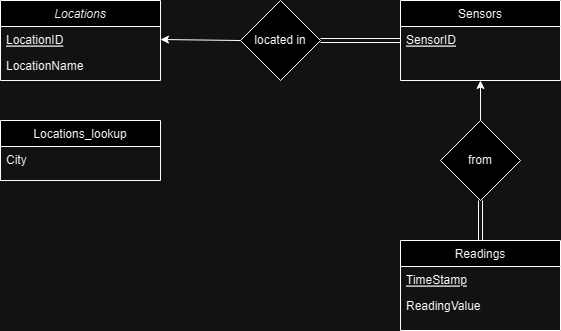
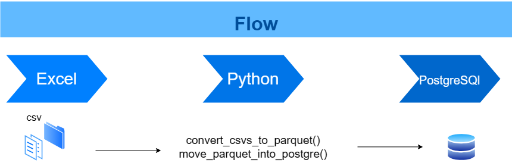

# Python + SQL data ingestion and analysis
This repository provides a Python and SQL pipeline and queries for ingesting and analyzing sensor data.

## Relation Diagram

> Assumptions:
> * Each sensor must be in at least one location.
> * A location does not have to have a sensor in it.
> * Each reading must come from only one sensor.
> * Each reading has a sensor.
__________________________________________________________________________________
## Flow
The pipeline consists of the following steps:

1. Convert CSV files to Parquet files.
2. Load Parquet files into PostgreSQL as raw data tables.
3. Transform the raw data tables into more concise and efficient tables for specific queries.
4. Write and run queries according to the given questions.
__________________________________________________________________________________

## Thinking Process
Here is how I've done it:

**Day 1**

* Understand the task and ask questions.
* Design the diagram of the relation tables.
* I've modified SMP data of electricity consumption that I had on my computer from previous project.
* Write a Python and SQL pipeline to transform and load the data: CSV --> Parquet --> PostgreSQL tables.
* Write the 2nd and 3rd query tasks.

**Day 2**

* Write the 4th query:

> I chose to create a table for each "type of period": hour_readings, daily_readings, monthly_readings.
> The primary key of each table is a pair of sensorID and "type of period". This way, it would be easy to select a specific sensor and month (for example) and get the average reading of that month.

* Write the 5th query tasks.
  > I've tried different window sizes, and finally, I chose a window of 9 hours for the moving average.
* Insert lookup table.
* Convert all the queries to Python in Pandas.
* Write the ETL vs. ELT evaluation notebook.
* Create the requirements.txt file and README.md file.

  # Project Structure 
  * Data Directory - the raw tables (csv and parquet)
  * Python\TimeSeriesAnalysis.py - Pandas queries/functions.
  * Python\python_and_sql_run_guide.ipynb - Show the flow of code of python + SQL.
  * SQL\tables_creations.sql - The tables creation queries.
  * SQL\insert_data_to_tables.sql - the queries that insert data from the raw tables to final tables.
  * SQL\queries.sql - the answers to the queries questions.
  * Output\Images - postgreSQL screenshots of the queries with the result table.
  * Output\Python Tables - csv tables created by the python script.
 
 **The SQL in `Python\python_and_sql_run_guide.ipynb` and `SQL` directory are same. So find your best view 😉**
  
